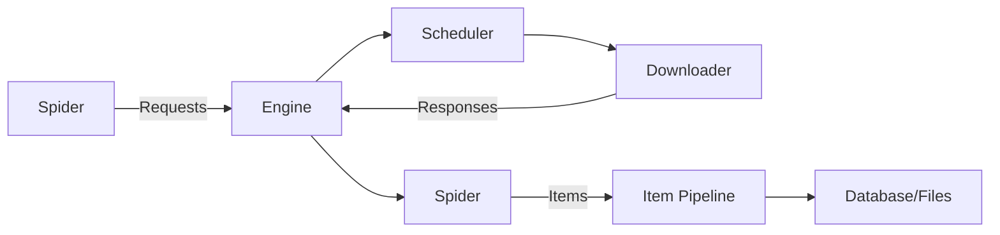
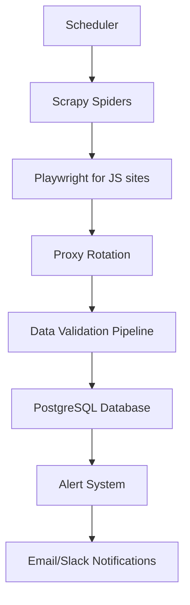

# Web Scraping: Zero to Hero

### Mastering Data Extraction with Python

<div class="abs-br m-6 flex gap-2">
  <a href="https://github.com/Jasonyou1995/web-scraping-tutorial" target="_blank" class="icon-btn opacity-50 !border-none !hover:opacity-100">
    <carbon-logo-github />
  </a>
</div>

<!--
Welcome to the ultimate web scraping tutorial! Today we'll go from absolute beginner to advanced practitioner, covering all major Python scraping tools with real-world examples and best practices.
-->

---

## Agenda

1. **Web Scraping Fundamentals** 🌐
2. **BeautifulSoup: Static Content** 🥣
3. **Selenium: Dynamic Content** 🧪
4. **Scrapy: Large-Scale Scraping** 🕷️
5. **Advanced Techniques & Ethics** ⚖️
6. **Real-World Project** 🚀

<!--
We'll start with the absolute basics - what is web scraping, how the web works, and legal considerations. Then we'll dive into each major tool with progressively more complex examples.
-->

---

## What is Web Scraping?

**Web scraping** = Automated extraction of data from websites

- **Why scrape?** 
  - Market research
  - Price monitoring
  - Content aggregation
  - Academic research
  - Competitor analysis

- **How it works:**
  ```mermaid
  graph LR
    A[Your Script] -->|HTTP Request| B[Web Server]
    B -->|HTML Response| A
    A --> C[Parse HTML]
    C --> D[Extract Data]
    D --> E[Store/Analyze]
  ```

<!--
Web scraping automates what humans do manually - visiting websites and copying information. But at scale and with precision.
-->

---

## The Web Basics You Need

### HTTP Requests & Responses
- **GET**: Retrieve data (most common for scraping)
- **POST**: Send data to server
- **Status Codes**: 200 (OK), 404 (Not Found), 403 (Forbidden), 500 (Server Error)

### HTML Structure
```html
<html>
  <head>
    <title>Page Title</title>
  </head>
  <body>
    <div class="container">
      <h1 id="main-title">Welcome</h1>
      <p class="description">This is a paragraph</p>
    </div>
  </body>
</html>
```

### CSS Selectors & XPath
- **CSS**: `.container h1#main-title`
- **XPath**: `//div[@class='container']/h1[@id='main-title']`

<!--
Understanding these fundamentals is crucial. Every scraping operation starts with an HTTP request and ends with parsing HTML structure.
-->

---

## Legal & Ethical Considerations ⚖️

### Always Check:
1. **robots.txt**: `https://example.com/robots.txt`
   ```txt
   User-agent: *
   Disallow: /private/
   Crawl-delay: 10
   ```
2. **Terms of Service**: Many sites prohibit scraping
3. **Copyright**: Don't republish copyrighted content
4. **Rate Limiting**: Don't overload servers (be polite!)

### Best Practices:
- Add delays between requests
- Use realistic user agents
- Respect `robots.txt`
- Cache responses when possible
- Monitor your impact

<!--
Ethics aren't optional! Bad scraping can get your IP banned or lead to legal trouble. Always be a good internet citizen.
-->

---

## Environment Setup

### Install Required Packages
```bash
# Core packages
pip install requests beautifulsoup4 lxml

# For dynamic content
pip install selenium webdriver-manager

# For large-scale scraping
pip install scrapy scrapy-playwright

# Utilities
pip install pandas fake-useragent python-dotenv
```

### Project Structure
```
web-scraper/
├── .env                 # Environment variables
├── requirements.txt
├── static_scraper.py    # BeautifulSoup examples
├── dynamic_scraper.py   # Selenium examples
├── scrapy_project/      # Scrapy project
└── utils.py             # Helper functions
```

<!--
Set up your environment properly from the start. Use virtual environments to avoid dependency conflicts!
-->

---

## Part 1: BeautifulSoup - Static Content

### When to Use BeautifulSoup?
- Simple, static HTML pages
- Fast extraction needs
- No JavaScript rendering required
- Lightweight projects

### Basic Workflow:
1. Fetch HTML with `requests`
2. Parse with BeautifulSoup
3. Navigate/extract with CSS selectors or methods
4. Process and store data

<!--
BeautifulSoup is perfect for beginners and simple scraping tasks. It's fast, lightweight, and has an intuitive API.
-->

---

## BeautifulSoup: Basic Syntax

### Fetching & Parsing
```python
import requests
from bs4 import BeautifulSoup

# Fetch the page
url = "https://example.com"
headers = {"User-Agent": "Mozilla/5.0..."}
response = requests.get(url, headers=headers)
response.raise_for_status()  # Raise exception for bad status

# Parse HTML
soup = BeautifulSoup(response.content, 'html.parser')
```

### Key Parsing Options:
- `'html.parser'`: Built-in, fast, lenient
- `'lxml'`: External, very fast, requires lxml
- `'html5lib'`: External, most lenient, slowest

<!--
Always handle HTTP errors! Use appropriate headers to mimic a real browser and avoid being blocked.
-->

---

## BeautifulSoup: Navigation & Extraction

### Finding Elements
```python
# Find first occurrence
title = soup.find('h1')  # Returns Tag object
title_text = title.get_text()  # "Welcome"

# Find all occurrences
paragraphs = soup.find_all('p', class_='description')

# Using CSS selectors
container = soup.select_one('.container')
all_links = soup.select('a[href]')  # All links with href
```

### Extracting Data
```python
# From Tag objects
print(title.name)        # 'h1'
print(title['id'])       # 'main-title'
print(title.get('class')) # ['hero-title'] or None

# Text content
text = title.get_text(strip=True)  # Clean text
```

<!--
BeautifulSoup's methods are intuitive: find() for single elements, find_all() for multiple. CSS selectors offer more power for complex queries.
-->

---

## BeautifulSoup: Practical Example

### Scrape Quotes from quotes.toscrape.com
```python
import requests
from bs4 import BeautifulSoup
import csv

def scrape_quotes():
    url = "http://quotes.toscrape.com"
    response = requests.get(url)
    soup = BeautifulSoup(response.text, 'html.parser')
    
    quotes = []
    for quote in soup.select('.quote'):
        text = quote.select_one('.text').get_text()
        author = quote.select_one('.author').get_text()
        tags = [tag.get_text() for tag in quote.select('.tag')]
        quotes.append({
            'text': text,
            'author': author,
            'tags': ', '.join(tags)
        })
    
    # Save to CSV
    with open('quotes.csv', 'w', newline='', encoding='utf-8') as f:
        writer = csv.DictWriter(f, fieldnames=['text', 'author', 'tags'])
        writer.writeheader()
        writer.writerows(quotes)
```

<!--
This example shows real-world scraping: extracting structured data from repeated elements and saving to CSV. Notice the clean CSS selectors!
-->

---

## Handling Pagination with BeautifulSoup

### Multiple Pages Strategy
```python
def scrape_all_quotes():
    base_url = "http://quotes.toscrape.com"
    all_quotes = []
    page = 1
    
    while True:
        url = f"{base_url}/page/{page}/"
        response = requests.get(url)
        
        # Break if no more pages
        if response.status_code == 404:
            break
            
        soup = BeautifulSoup(response.text, 'html.parser')
        
        # Check if page has quotes
        if not soup.select('.quote'):
            break
            
        # Extract quotes (same as before)
        for quote in soup.select('.quote'):
            # ... extraction code ...
            
        page += 1
        time.sleep(1)  # Be polite!
    
    return all_quotes
```

<!--
Pagination is common! Always check for end conditions (404, empty results) and add delays between requests.
-->

---

## Part 2: Selenium - Dynamic Content

### When to Use Selenium?
- JavaScript-rendered content
- Pages requiring interaction (clicks, forms)
- Single Page Applications (SPAs)
- Complex user workflows

### How It Works:
- Controls a real browser (Chrome, Firefox)
- Executes JavaScript
- Waits for elements to load
- Handles cookies/sessions

<!--
Selenium is your go-to when content is loaded dynamically via JavaScript. It's slower but more powerful for complex sites.
-->

---

## Selenium Setup & Basics

### Installation & Setup
```python
from selenium import webdriver
from selenium.webdriver.common.by import By
from selenium.webdriver.support.ui import WebDriverWait
from selenium.webdriver.support import expected_conditions as EC
from webdriver_manager.chrome import ChromeDriverManager

# Auto-manage driver
driver = webdriver.Chrome(ChromeDriverManager().install())

# Or with options for headless mode
options = webdriver.ChromeOptions()
options.add_argument('--headless')
driver = webdriver.Chrome(options=options)
```

### Basic Navigation
```python
driver.get("https://example.com")
title = driver.title
current_url = driver.current_url
driver.quit()  # Always close!
```

<!--
Always use webdriver-manager to avoid driver version issues. Headless mode is essential for servers without GUI.
-->

---

## Selenium: Locating Elements

### Finding Elements
```python
# By ID
element = driver.find_element(By.ID, "main-title")

# By CSS Selector
element = driver.find_element(By.CSS_SELECTOR, ".container h1")

# By XPath
element = driver.find_element(By.XPATH, "//div[@class='container']/h1")

# Find multiple
elements = driver.find_elements(By.CLASS_NAME, "quote")
```

### Locator Strategies:
| Strategy | Example |
|----------|---------|
| `By.ID` | `"username"` |
| `By.NAME` | `"password"` |
| `By.CLASS_NAME` | `"btn-primary"` |
| `By.TAG_NAME` | `"div"` |
| `By.CSS_SELECTOR` | `"div.container > h1"` |
| `By.XPATH` | `"//input[@type='submit']"` |

<!--
CSS selectors are usually preferred for readability, but XPath is more powerful for complex traversals.
-->

---

## Selenium: Waiting Strategies

### Why Wait?
- Pages load asynchronously
- Elements appear after delays
- Avoid "element not found" errors

### Explicit Waits (Recommended)
```python
wait = WebDriverWait(driver, 10)  # Max 10 seconds

# Wait until element is present
element = wait.until(
    EC.presence_of_element_located((By.CLASS_NAME, "quote"))
)

# Wait until element is clickable
button = wait.until(
    EC.element_to_be_clickable((By.ID, "load-more"))
)
button.click()
```

### Common Expected Conditions:
- `presence_of_element_located`
- `visibility_of_element_located`
- `element_to_be_clickable`
- `text_to_be_present_in_element`
- `url_contains`

<!--
Never use time.sleep()! Explicit waits are smarter - they proceed as soon as the condition is met, saving time.
-->

---

## Selenium: Practical Example

### Scrape Infinite Scroll Page
```python
def scrape_infinite_scroll():
    driver.get("https://quotes.toscrape.com/scroll")
    wait = WebDriverWait(driver, 10)
    
    quotes = []
    last_height = driver.execute_script("return document.body.scrollHeight")
    
    while True:
        # Scroll to bottom
        driver.execute_script("window.scrollTo(0, document.body.scrollHeight);")
        
        # Wait for new content
        try:
            wait.until(lambda d: d.execute_script(
                "return document.body.scrollHeight") > last_height
            )
        except TimeoutException:
            break  # No more content
            
        # Update height
        new_height = driver.execute_script("return document.body.scrollHeight")
        if new_height == last_height:
            break
        last_height = new_height
        
        # Extract current quotes
        quote_elements = driver.find_elements(By.CLASS_NAME, "quote")
        for q in quote_elements[len(quotes):]:  # Only new ones
            text = q.find_element(By.CLASS_NAME, "text").text
            author = q.find_element(By.CLASS_NAME, "author").text
            quotes.append({"text": text, "author": author})
    
    driver.quit()
    return quotes
```

<!--
Infinite scroll is tricky! We scroll, wait for new content, then extract only the newly loaded items to avoid duplicates.
-->

---

## Part 3: Scrapy - Large-Scale Scraping

### When to Use Scrapy?
- Large-scale projects (1000s of pages)
- Structured data pipelines
- Built-in concurrency & speed
- Middleware support (proxies, retries)
- Built-in stats & monitoring

### Scrapy Architecture:


<!--
Scrapy is a full framework - not just a library. It handles concurrency, retries, and data pipelines out of the box.
-->

---

## Scrapy Setup & Project Structure

### Create a Project
```bash
scrapy startproject bookscraper
cd bookscraper
scrapy genspider books books.toscrape.com
```

### Project Structure
```
bookscraper/
├── scrapy.cfg
└── bookscraper/
    ├── __init__.py
    ├── items.py          # Define data structure
    ├── middlewares.py    # Custom middleware
    ├── pipelines.py      # Data processing
    ├── settings.py       # Configuration
    └── spiders/
        └── books.py      # Your spider
```

<!--
Scrapy projects are organized with clear separation of concerns. Each component has a specific role.
-->

---

## Scrapy: Items & Spiders

### Define Data Structure (items.py)
```python
import scrapy

class BookItem(scrapy.Item):
    title = scrapy.Field()
    price = scrapy.Field()
    availability = scrapy.Field()
    rating = scrapy.Field()
    image_url = scrapy.Field()
```

### Basic Spider (spiders/books.py)
```python
import scrapy
from bookscraper.items import BookItem

class BooksSpider(scrapy.Spider):
    name = 'books'
    start_urls = ['http://books.toscrape.com/']
    
    def parse(self, response):
        for book in response.css('article.product_pod'):
            item = BookItem()
            item['title'] = book.css('h3 a::attr(title)').get()
            item['price'] = book.css('.price_color::text').get()
            yield item  # Send to pipeline
        
        # Follow pagination
        next_page = response.css('.next a::attr(href)').get()
        if next_page:
            yield response.follow(next_page, self.parse)
```

<!--
Scrapy uses generators (yield) for memory efficiency. Items define your data schema, making pipelines type-safe.
-->

---

## Scrapy: Pipelines & Settings

### Custom Pipeline (pipelines.py)
```python
class PriceConverterPipeline:
    def process_item(self, item, spider):
        # Convert price to float
        price = item['price']
        if price:
            item['price'] = float(price.replace('£', ''))
        return item

class DuplicatesPipeline:
    def __init__(self):
        self.titles_seen = set()
    
    def process_item(self, item, spider):
        if item['title'] in self.titles_seen:
            raise DropItem(f"Duplicate item: {item['title']}")
        self.titles_seen.add(item['title'])
        return item
```

### Enable Pipelines (settings.py)
```python
ITEM_PIPELINES = {
    'bookscraper.pipelines.PriceConverterPipeline': 300,
    'bookscraper.pipelines.DuplicatesPipeline': 400,
}
```

<!--
Pipelines process items sequentially. Lower numbers run first. Use them for validation, cleaning, and storage.
-->

---

## Scrapy: Advanced Features

### Built-in Exporters
```bash
# Export to multiple formats
scrapy crawl books -o books.json
scrapy crawl books -o books.csv
scrapy crawl books -o books.xml
```

### Settings for Production
```python
# settings.py
ROBOTSTXT_OBEY = True
CONCURRENT_REQUESTS = 16
DOWNLOAD_DELAY = 1
RANDOMIZE_DOWNLOAD_DELAY = True
USER_AGENT = 'MyScraperBot (+http://example.com)'
COOKIES_ENABLED = False
```

### Middleware for Proxies & Retries
```python
# Custom retry middleware
RETRY_TIMES = 3
RETRY_HTTP_CODES = [500, 502, 503, 504, 408, 429]
```

<!--
Scrapy's built-in features handle most production needs. Configure settings carefully for ethical scraping.
-->

---

## Part 4: Advanced Techniques

### Handling JavaScript with Scrapy-Playwright
```python
# In spider
def parse(self, response):
    yield scrapy.Request(
        url,
        meta=dict(
            playwright=True,
            playwright_include_page=True,
        ),
        callback=self.parse_page,
    )

async def parse_page(self, response):
    page = response.meta["playwright_page"]
    await page.wait_for_selector(".dynamic-content")
    # Extract data...
    await page.close()
```

### Rotating Proxies & User Agents
```python
# settings.py
DOWNLOADER_MIDDLEWARES = {
    'scrapy.downloadermiddlewares.useragent.UserAgentMiddleware': None,
    'scrapy_user_agents.middlewares.RandomUserAgentMiddleware': 400,
    'rotating_proxies.middlewares.RotatingProxyMiddleware': 610,
}

ROTATING_PROXY_LIST = [
    'http://proxy1:port',
    'http://proxy2:port',
]
```

<!--
For complex sites, combine Scrapy's speed with Playwright's JS capabilities. Always rotate user agents and use proxies for large-scale scraping.
-->

---

## Anti-Scraping Measures & Solutions

### Common Blocks:
- **IP Bans**: Use proxy rotation
- **Rate Limiting**: Add delays, respect robots.txt
- **CAPTCHAs**: Avoid by being human-like, or use services
- **Honeypot Traps**: Ignore hidden elements
- **Dynamic Content**: Use Selenium/Playwright

### Detection Prevention:
```python
# Realistic request patterns
import random
time.sleep(random.uniform(1, 3))

# Human-like headers
headers = {
    'User-Agent': random.choice(USER_AGENTS),
    'Accept': 'text/html,application/xhtml+xml',
    'Accept-Language': 'en-US,en;q=0.9',
    'Accept-Encoding': 'gzip, deflate',
    'Connection': 'keep-alive',
}
```

<!--
Modern sites are sophisticated! Mimic human behavior: random delays, realistic headers, and avoid suspicious patterns.
-->

---

## Data Storage Strategies

### Simple Projects:
- CSV/JSON files
- SQLite database

### Large Projects:
- PostgreSQL/MySQL
- MongoDB (for unstructured data)
- Cloud storage (S3, GCS)

### Example: Save to Database
```python
# In Scrapy pipeline
import sqlite3

class DatabasePipeline:
    def open_spider(self, spider):
        self.connection = sqlite3.connect('books.db')
        self.cursor = self.connection.cursor()
        self.cursor.execute('''
            CREATE TABLE IF NOT EXISTS books
            (title TEXT, price REAL, availability TEXT)
        ''')
    
    def process_item(self, item, spider):
        self.cursor.execute(
            "INSERT INTO books VALUES (?, ?, ?)",
            (item['title'], item['price'], item['availability'])
        )
        return item
    
    def close_spider(self, spider):
        self.connection.commit()
        self.connection.close()
```

<!--
Choose storage based on scale and query needs. Databases are essential for large datasets requiring complex queries.
-->

---

## Monitoring & Debugging

### Scrapy Stats
```python
# Enable stats collection
STATS_CLASS = 'scrapy.statscollectors.MemoryStatsCollector'

# View stats after crawl
# {'downloader/request_count': 100,
#  'downloader/response_status_count/200': 95,
#  'item_scraped_count': 95}
```

### Logging Best Practices
```python
import logging
logger = logging.getLogger(__name__)

def parse(self, response):
    if response.status != 200:
        logger.warning(f"Failed to load {response.url}")
    else:
        logger.info(f"Scraped {len(quotes)} quotes from {response.url}")
```

### Debugging Tools:
- Scrapy shell: `scrapy shell "http://example.com"`
- Browser dev tools (Network tab)
- Proxy tools (Charles, Fiddler)

<!--
Monitor your scrapers! Track success rates, response times, and error patterns to maintain reliability.
-->

---

## Real-World Project: E-commerce Price Tracker

### Requirements:
- Track prices for 100 products across 3 sites
- Alert when prices drop below threshold
- Store historical prices
- Handle dynamic content and anti-bot measures

### Architecture:


<!--
This project combines all techniques: Scrapy for efficiency, Playwright for dynamic content, proxies for reliability, and proper data storage.
-->

---

## Best Practices Summary

### Technical:
- Always handle errors gracefully
- Use appropriate delays between requests
- Validate and clean extracted data
- Monitor your scrapers
- Cache responses when possible

### Ethical:
- Respect robots.txt
- Check terms of service
- Don't overload servers
- Attribute data sources
- Consider APIs first

### Legal:
- Consult lawyers for commercial use
- Understand copyright laws
- Comply with GDPR/CCPA for personal data
- Avoid scraping private/protected data

<!--
Remember: With great scraping power comes great responsibility. Always prioritize ethics and legality.
-->

---

## Resources & Next Steps

### Learning Resources:
- [Scrapy Documentation](https://docs.scrapy.org/)
- [Selenium Documentation](https://www.selenium.dev/documentation/)
- [BeautifulSoup Documentation](https://www.crummy.com/software/BeautifulSoup/bs4/doc/)
- [Web Scraping Academy](https://www.scrapingbee.com/academy)

### Practice Sites:
- http://quotes.toscrape.com
- http://books.toscrape.com
- http://httpbin.org (for testing)

### Advanced Topics:
- Distributed scraping (Scrapy Cluster)
- Machine learning for data extraction
- Headless browser automation at scale
- Building scraping APIs

<!--
Practice is key! Start with the practice sites, then move to real projects. Always stay updated with new tools and techniques.
-->

---

# Thank You!

### Questions?

<div class="grid grid-cols-2 gap-4 mt-10">
  <div>
    <h3 class="text-xl mb-2">GitHub</h3>
    <code>github.com/Jasonyou1995/web-scraping-tutorial</code>
  </div>
  <div>
    <h3 class="text-xl mb-2">Contact</h3>
    <code>jason.you1995@gmail.com</code>
  </div>
</div>

<!--
Remember: Web scraping is a powerful skill, but use it responsibly. Happy scraping!
-->
