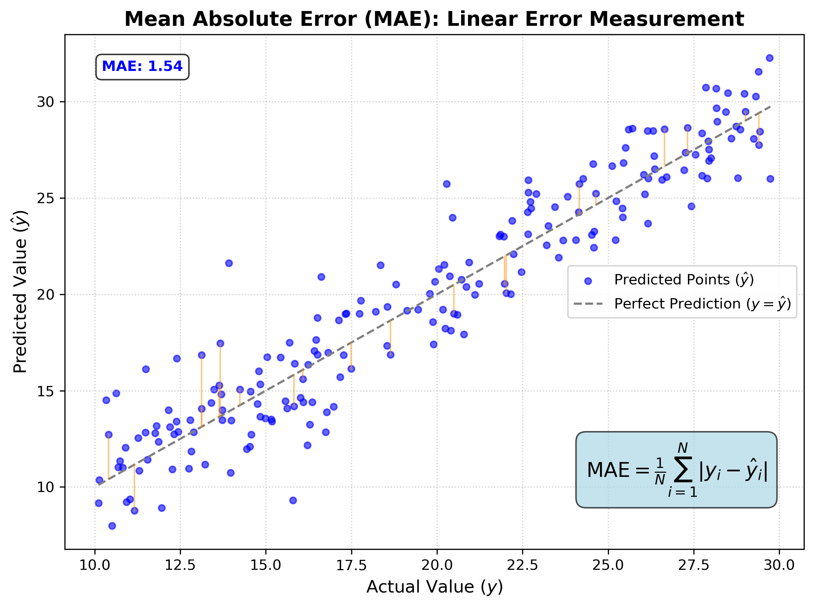
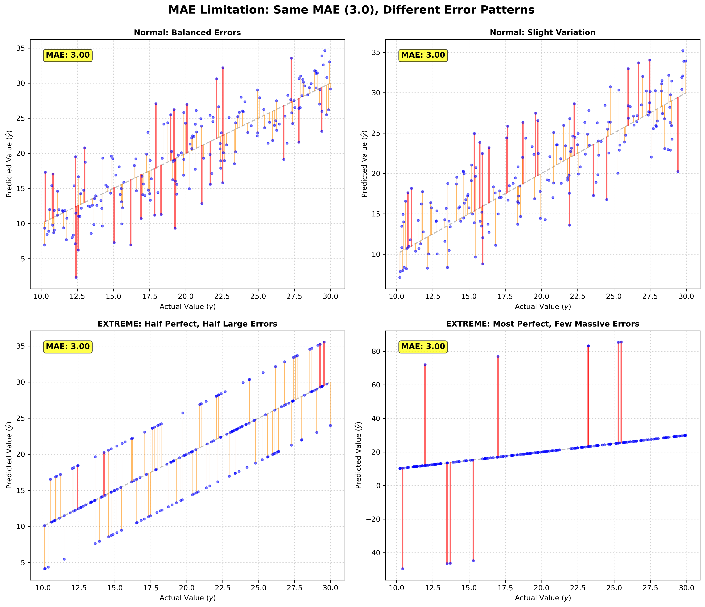
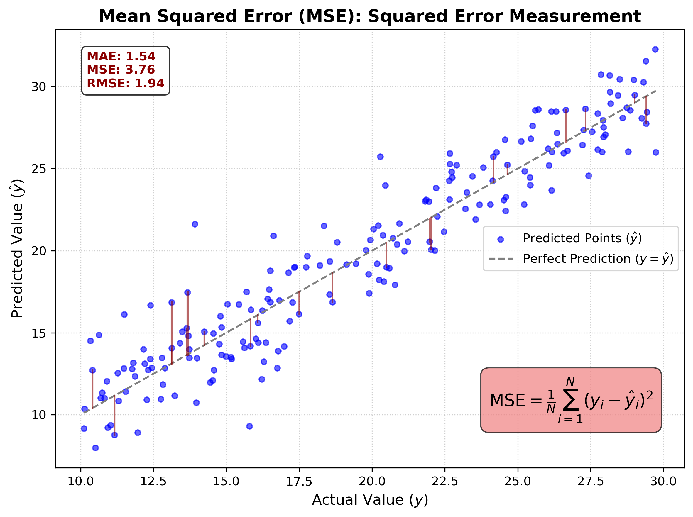
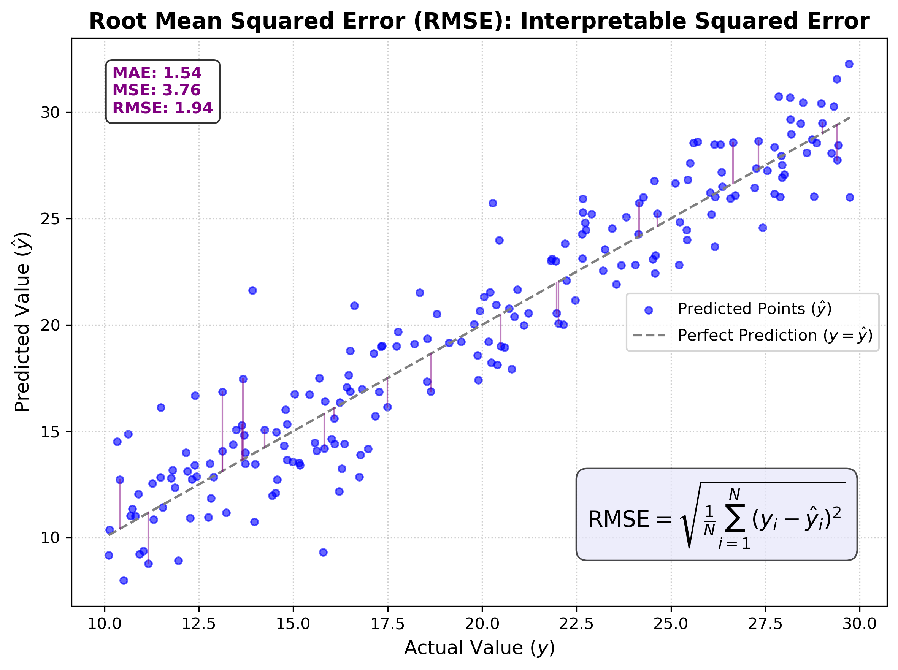
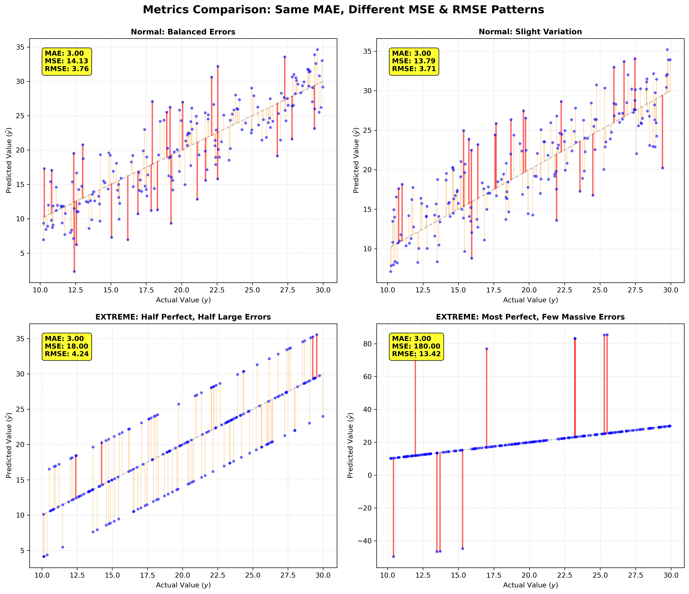

# Regression Evaluation Metrics

## MAE, MSE, and RMSE Explained

<div class="pt-12">
  <span @click="$slidev.nav.next" class="px-2 py-1 rounded cursor-pointer" flex="~ justify-center items-center gap-2" hover="bg-white bg-opacity-10">
    Press Space for next page <div class="i-carbon:arrow-right inline-block"/>
  </span>
</div>

<!--
Welcome! Today we'll explore three essential metrics for evaluating regression models:
Mean Absolute Error (MAE), Mean Squared Error (MSE), and Root Mean Squared Error (RMSE).
We'll understand the mathematics behind each, see why they matter, and practice implementing them.
-->

---

# Three Types of Metrics

<v-clicks>

## 1. Mean Absolute Error (MAE)
**Also called L1 norm**

## 2. Mean Squared Error (MSE)
**Squares the errors**

## 3. Root Mean Squared Error (RMSE)
**Most preferred in ML community**

</v-clicks>

<!--
We have three main metrics for regression evaluation. Each serves a different purpose
and has unique characteristics. Let's explore them one by one.
-->

---

# Mean Absolute Error (MAE)

<div class="grid grid-cols-2 gap-8">

<div>

## Formula

$$\text{MAE} = \frac{1}{N} \sum_{i=1}^{N} |y_i - \hat{y}_i|$$

</div>

<div>

## What It Does

<v-clicks>

- Finds **absolute distances** between predicted and actual values
- Takes the **absolute value** of each error
- **Adds them up** and divides by total number of data points
- Also called **L1 norm**

</v-clicks>

</div>

</div>

<!--
MAE is the simplest metric. It just measures the average absolute difference
between what we predicted and what actually happened. No squaring, no complexity.
-->

---

# MAE Visualization

<div class="flex justify-center">



</div>

<!--
This visualization shows how MAE calculates errors. Notice the orange lines
connecting actual to predicted values - these represent the absolute errors.
-->

---

# MAE Limitation

<div class="flex justify-center">



</div>

<div v-click class="mt-4 p-4 bg-yellow-100 rounded-lg">
<strong>Problem:</strong> All four scenarios have the same MAE (3.0), but very different error patterns!
</div>

<!--
Here's the problem with MAE: it doesn't punish large errors. A model with
many small errors gets the same score as a model with a few massive errors.
This is why we need other metrics.
-->

---

# Why We Need MSE

<div class="text-left" style="max-width: 800px; margin: 0 auto;">

<v-clicks>

## The Problem with MAE

- **Does not punish large errors**
- Takes the average of errors of different magnitudes
- A bad model can get a similar score as a well-performed model

## The Solution: MSE

- **Squares the errors** before averaging
- Large errors become **exponentially larger** when squared
- Bad models become **more obvious**

</v-clicks>

</div>

<!--
When we square errors, small errors stay small, but large errors become huge.
This makes it much easier to spot models with extreme prediction errors.
-->

---

# Mean Squared Error (MSE)

<div class="grid grid-cols-2 gap-8">

<div>

## Formula

$$\text{MSE} = \frac{1}{N} \sum_{i=1}^{N} (y_i - \hat{y}_i)^2$$

</div>

<div>

## Key Feature

<v-clicks>

- **Squares each error** before averaging
- Large errors are **penalized more heavily**
- Thicker error lines = larger squared errors

</v-clicks>

</div>

</div>

<!--
MSE squares each error, which means errors of 2 become 4, errors of 5 become 25.
This exponential growth makes large errors stand out dramatically.
-->

---

# MSE Visualization

<div class="flex justify-center">



</div>

<div v-click class="mt-4 p-4 bg-red-100 rounded-lg">
Notice how the **thickness** of error lines represents squared error magnitude!
</div>

<!--
In this visualization, you can see that larger errors create thicker lines.
This visual representation helps us understand how MSE emphasizes large errors.
-->

---

# MSE Drawback

<div class="text-left" style="max-width: 800px; margin: 0 auto;">

<v-clicks>

## The Problem

- After squaring, the **units change**
- If original data is in **dollars**, MSE is in **dollars squared**
- **Cannot directly compare** with original data units

## Example

- Actual value: $100
- Error: $10
- MSE contribution: $100 (squared!)
- **Hard to interpret** in original context

</v-clicks>

</div>

<!--
This is a real problem - when you square dollars, you get "dollars squared"
which doesn't make intuitive sense. We need a metric that keeps the original units.
-->

---

# Root Mean Squared Error (RMSE)

<div class="grid grid-cols-2 gap-8">

<div>

## Formula

$$\text{RMSE} = \sqrt{\frac{1}{N} \sum_{i=1}^{N} (y_i - \hat{y}_i)^2}$$

</div>

<div>

## Why It's Preferred

<v-clicks>

- **Preserves original units** (take square root)
- **Still punishes large errors** (squaring happens first)
- **Most interpretable** metric
- **Industry standard** for regression

</v-clicks>

</div>

</div>

<!--
RMSE gives us the best of both worlds: the penalty structure of MSE
but with interpretable units. This is why it's so popular.
-->

---

# RMSE Visualization

<div class="flex justify-center">



</div>

<div v-click class="mt-4 p-4 bg-purple-100 rounded-lg">
RMSE = √MSE: Same penalty structure, but in **original units**!
</div>

<!--
This visualization shows RMSE in action. Notice it maintains the same
error structure as MSE but brings everything back to interpretable units.
-->

---

# Why Does RMSE Still Punish Large Errors?

<div class="text-left" style="max-width: 900px; margin: 0 auto;">

## The Question

<div class="p-4 bg-blue-100 rounded-lg mb-4">
"If we square and then take the root, why does RMSE still punish large errors?<br>
Isn't it just becoming the same as MAE?"
</div>

<v-clicks>

## The Answer

**No!** The order of operations matters:

1. **First**: Square each error → Large errors become **much larger**
2. **Then**: Average all squared errors
3. **Finally**: Take square root of the **average**

The square root is applied to the **average**, not to each individual error!

</v-clicks>

</div>

<!--
This is a crucial concept students often misunderstand. The square root doesn't
undo the squaring because it's applied to the average, not each error individually.
-->

---

# Mathematical Explanation

<div class="text-left" style="max-width: 900px; margin: 0 auto;">

## Example: Two Models

**Model A**: Errors = [1, 1, 1, 1, 1]  
**Model B**: Errors = [0, 0, 0, 0, 5]

<v-clicks>

### MAE Calculation
- Model A: (1+1+1+1+1)/5 = **1.0**
- Model B: (0+0+0+0+5)/5 = **1.0**
- **Same MAE!**

### RMSE Calculation
- Model A: √[(1²+1²+1²+1²+1²)/5] = √[5/5] = **1.0**
- Model B: √[(0²+0²+0²+0²+5²)/5] = √[25/5] = **2.24**
- **RMSE detects the large error!**

</v-clicks>

</div>

<div v-click class="mt-4 p-4 bg-green-100 rounded-lg">
<strong>Key Insight:</strong> Squaring happens BEFORE averaging, so large errors dominate the average!
</div>

<!--
This concrete example shows exactly why RMSE works. The squaring amplifies
the large error before averaging, so even after taking the square root,
the large error's impact remains.
-->

---

# All Metrics Comparison

<div class="flex justify-center">



</div>

<div v-click class="mt-4 p-4 bg-yellow-100 rounded-lg">
Notice how **MSE and RMSE differ dramatically** even when MAE is identical!
</div>

<!--
This comprehensive comparison shows all three metrics side by side.
You can clearly see how MSE and RMSE reveal problems that MAE misses.
-->

---

# Summary: When to Use Each Metric

<div class="grid grid-cols-3 gap-6">

<div>

## MAE
- **Simple** and interpretable
- **Robust** to outliers
- Use when all errors matter **equally**

</div>

<div>

## MSE
- **Penalizes large errors** heavily
- Used in optimization (gradient descent)
- Units are **squared**

</div>

<div>

## RMSE
- **Most preferred** in practice
- **Interpretable** units
- **Penalizes large errors**
- **Industry standard**

</div>

</div>

<!--
Each metric has its place. MAE for simplicity, MSE for optimization,
and RMSE for the best balance of interpretability and error detection.
-->

---

# Exercise: Manual Implementation

<div class="text-left" style="max-width: 900px; margin: 0 auto;">

## Instructions

Write your own Python implementation of the three metrics for evaluating regression models.

**Do NOT use scikit-learn** - implement from scratch!

</div>

<div class="mt-6">

## Mathematical Equations

<v-clicks>

$$\text{MAE} = \frac{1}{N} \sum_{i=1}^{N} |y_i - \hat{y}_i|$$

$$\text{MSE} = \frac{1}{N} \sum_{i=1}^{N} (y_i - \hat{y}_i)^2$$

$$\text{RMSE} = \sqrt{\frac{1}{N} \sum_{i=1}^{N} (y_i - \hat{y}_i)^2}$$

</v-clicks>

</div>

<!--
Now it's time to practice! Students should implement these metrics manually
to truly understand how they work. This builds deep understanding.
-->

---

# Exercise: Setup Code

<div class="text-left" style="max-width: 900px; margin: 0 auto;">

## Step 1: Generate Random Dataset

```python {monaco}
import numpy as np

# Generate random data
np.random.seed(42)
N = 100
y_true = np.random.uniform(10, 30, N)
y_pred = y_true + np.random.normal(0, 2, N)
```

</div>

<div v-click class="mt-4">

## Step 2: Import Necessary Libraries

```python {monaco}
import numpy as np
# Only numpy needed for manual implementation!
```

</div>

<!--
First, we need to set up our data. We'll generate random actual and predicted
values, then implement each metric step by step.
-->

---

# Exercise: MAE Implementation

<div class="text-left" style="max-width: 900px; margin: 0 auto;">

## Your Turn: Implement MAE

$$\text{MAE} = \frac{1}{N} \sum_{i=1}^{N} |y_i - \hat{y}_i|$$

<div class="mt-4">

```python {monaco}
# Write your MAE implementation
# Hint: Use np.abs() for absolute value
```

</div>

</div>

<!--
Students should try implementing MAE first. It's the simplest one and builds
confidence for the more complex metrics.
-->

---

# Exercise: MAE Solution

<div class="text-left" style="max-width: 900px; margin: 0 auto;">

## MAE Implementation

```python {monaco}
import numpy as np

def mae(y_true, y_pred):
    """
    Calculate Mean Absolute Error
    
    Parameters:
    y_true: array-like, actual values
    y_pred: array-like, predicted values
    
    Returns:
    float: Mean Absolute Error
    """
    errors = np.abs(y_true - y_pred)
    return np.mean(errors) # OR np.sum(errors) / len(y_true)

# Example usage
mae_value = mae(y_true, y_pred)
print(f"MAE: {mae_value:.4f}")
```

</div>

<!--
Here's the solution for MAE. Notice how we use np.abs() to get absolute values,
then np.mean() to average them. Simple and clean!
-->

---

# Exercise: MSE Implementation

<div class="text-left" style="max-width: 900px; margin: 0 auto;">

## Your Turn: Implement MSE

$$\text{MSE} = \frac{1}{N} \sum_{i=1}^{N} (y_i - \hat{y}_i)^2$$

<div class="mt-4">

```python {monaco}
# Write your MSE implementation
# Hint: Square the errors before averaging
```

</div>

</div>

<!--
Now for MSE. Students need to square the errors before averaging.
This is where the penalty for large errors comes from.
-->

---

# Exercise: MSE Solution

<div class="text-left" style="max-width: 900px; margin: 0 auto;">

## MSE Implementation

```python {monaco}
import numpy as np

def mse(y_true, y_pred):
    """
    Calculate Mean Squared Error
    
    Parameters:
    y_true: array-like, actual values
    y_pred: array-like, predicted values
    
    Returns:
    float: Mean Squared Error
    """
    errors_squared = (y_true - y_pred) ** 2
    return np.mean(errors_squared)

# Example usage
mse_value = mse(y_true, y_pred)
print(f"MSE: {mse_value:.4f}")
```

</div>

<!--
MSE implementation squares the errors first, then averages. Notice how
this amplifies large errors compared to MAE.
-->

---

# Exercise: RMSE Implementation

<div class="text-left" style="max-width: 900px; margin: 0 auto;">

## Your Turn: Implement RMSE

$$\text{RMSE} = \sqrt{\frac{1}{N} \sum_{i=1}^{N} (y_i - \hat{y}_i)^2}$$

<div class="mt-4">

```python {monaco}
# Write your RMSE implementation here
# Hint: RMSE = sqrt(MSE)
```

</div>

</div>

<!--
Finally, RMSE. Students can either implement it from scratch or use
the MSE function they just wrote. Both approaches are valid.
-->

---

# Exercise: RMSE Solution

<div class="text-left" style="max-width: 900px; margin: 0 auto;">

## RMSE Implementation

```python {monaco}
import numpy as np

def rmse(y_true, y_pred):
    """
    Calculate Root Mean Squared Error
    
    Parameters:
    y_true: array-like, actual values
    y_pred: array-like, predicted values
    
    Returns:
    float: Root Mean Squared Error
    """
    errors_squared = (y_true - y_pred) ** 2
    mse_value = np.mean(errors_squared)
    return np.sqrt(mse_value)

# Alternative: Using MSE function
def rmse_alt(y_true, y_pred):
    return np.sqrt(mse(y_true, y_pred))

# Example usage
rmse_value = rmse(y_true, y_pred)
print(f"RMSE: {rmse_value:.4f}")
```

</div>

<!--
RMSE is simply the square root of MSE. This brings the units back to
the original scale while maintaining the penalty structure.
-->

---

# Complete Manual Implementation

<div class="text-left" style="max-width: 900px; margin: 0 auto;">

## All Three Metrics Together

```python {monaco}
import numpy as np

# Generate random data
np.random.seed(42)
N = 100
y_true = np.random.uniform(10, 30, N)
y_pred = y_true + np.random.normal(0, 2, N)

# MAE
def mae(y_true, y_pred):
    return np.mean(np.abs(y_true - y_pred))

# MSE
def mse(y_true, y_pred):
    return np.mean((y_true - y_pred) ** 2)

# RMSE
def rmse(y_true, y_pred):
    return np.sqrt(np.mean((y_true - y_pred) ** 2))

# Calculate all metrics
print(f"MAE:  {mae(y_true, y_pred):.4f}")
print(f"MSE:  {mse(y_true, y_pred):.4f}")
print(f"RMSE: {rmse(y_true, y_pred):.4f}")
```

</div>

<!--
Here's the complete manual implementation. Students can see all three
metrics implemented cleanly and compare their results.
-->

---

# Using Scikit-Learn

<div class="text-left" style="max-width: 900px; margin: 0 auto;">

## Import Libraries

```python {monaco}
import numpy as np
from sklearn.metrics import mean_absolute_error, mean_squared_error
```

</div>

<div v-click class="mt-6">

## Calculate Metrics

```python {monaco}
# Generate random data
np.random.seed(42)
N = 100
y_true = np.random.uniform(10, 30, N)
y_pred = y_true + np.random.normal(0, 2, N)

# Using scikit-learn
mae_sklearn = mean_absolute_error(y_true, y_pred)
mse_sklearn = mean_squared_error(y_true, y_pred)
rmse_sklearn = np.sqrt(mean_squared_error(y_true, y_pred))

print(f"MAE:  {mae_sklearn:.4f}")
print(f"MSE:  {mse_sklearn:.4f}")
print(f"RMSE: {rmse_sklearn:.4f}")
```

</div>

<!--
Now we show how to use scikit-learn. This is much simpler, but it's important
that students understand the manual implementation first.
-->

---

# Comparison: Manual vs Scikit-Learn

<div class="text-left" style="max-width: 900px; margin: 0 auto;">

## Verify Your Implementation

```python {monaco}
import numpy as np
from sklearn.metrics import mean_absolute_error, mean_squared_error

# Generate data
np.random.seed(42)
N = 100
y_true = np.random.uniform(10, 30, N)
y_pred = y_true + np.random.normal(0, 2, N)

# Manual implementation
mae_manual = np.mean(np.abs(y_true - y_pred))
mse_manual = np.mean((y_true - y_pred) ** 2)
rmse_manual = np.sqrt(mse_manual)

# Scikit-learn
mae_sklearn = mean_absolute_error(y_true, y_pred)
mse_sklearn = mean_squared_error(y_true, y_pred)
rmse_sklearn = np.sqrt(mean_squared_error(y_true, y_pred))

# Compare
print(f"MAE:  Manual={mae_manual:.6f}, Sklearn={mae_sklearn:.6f}")
print(f"MSE:  Manual={mse_manual:.6f}, Sklearn={mse_sklearn:.6f}")
print(f"RMSE: Manual={rmse_manual:.6f}, Sklearn={rmse_sklearn:.6f}")
```

</div>

<div v-click class="mt-4 p-4 bg-green-100 rounded-lg">
<strong>They should match!</strong> This verifies your understanding.
</div>

<!--
This comparison helps students verify their manual implementation is correct.
If the values match, they've understood the concepts correctly.
-->

---

# Key Takeaways

<div class="text-left" style="max-width: 900px; margin: 0 auto;">

<v-clicks>

1. **MAE**: Simple, interpretable, but doesn't penalize large errors

2. **MSE**: Penalizes large errors heavily, but units are squared

3. **RMSE**: Best of both worlds - interpretable units + error penalty

4. **Why RMSE works**: Squaring happens BEFORE averaging, so large errors dominate

5. **Implementation**: Understand manual calculation before using libraries

</v-clicks>

</div>

<div v-click class="mt-6 p-4 bg-blue-100 rounded-lg">
<strong>Remember:</strong> RMSE is the most preferred metric in the machine learning community!
</div>

<!--
Let's summarize what we've learned. These key points should stick with students
as they evaluate regression models in their future work.
-->

---

# Thank You!

<div class="text-center">

## Questions?

Practice implementing these metrics and explore how they behave with different error patterns.

<div class="mt-8">

**Next Steps:**
- Try implementing on your own datasets
- Compare metrics across different models
- Explore when each metric is most appropriate

</div>

</div>

<!--
Thank you for following along! Students should now have a solid understanding
of regression evaluation metrics and be able to implement them confidently.
-->

